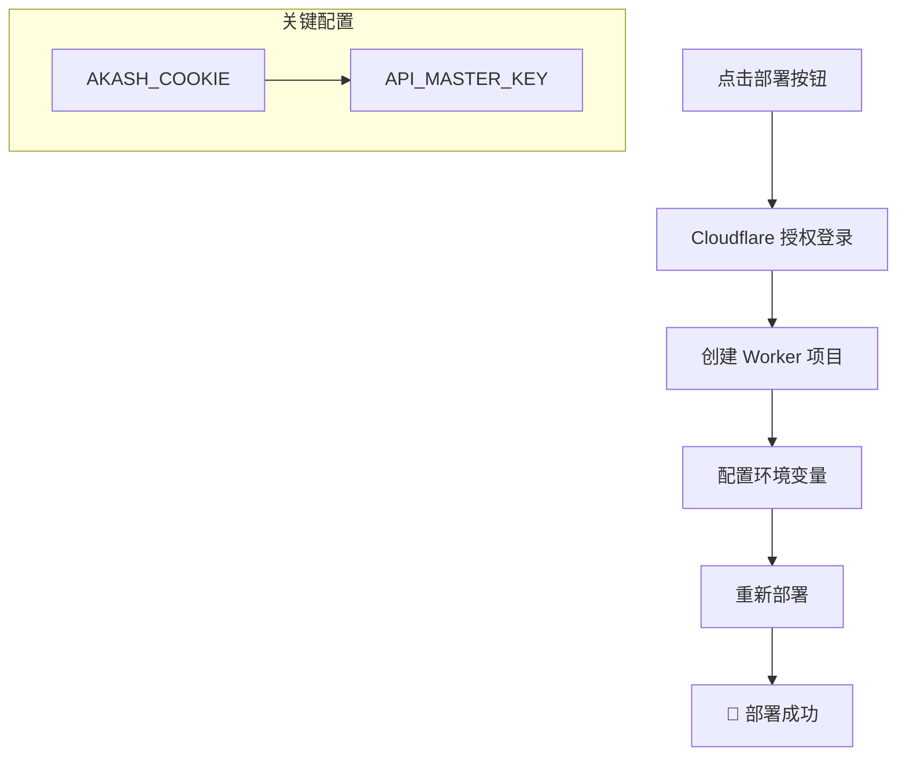
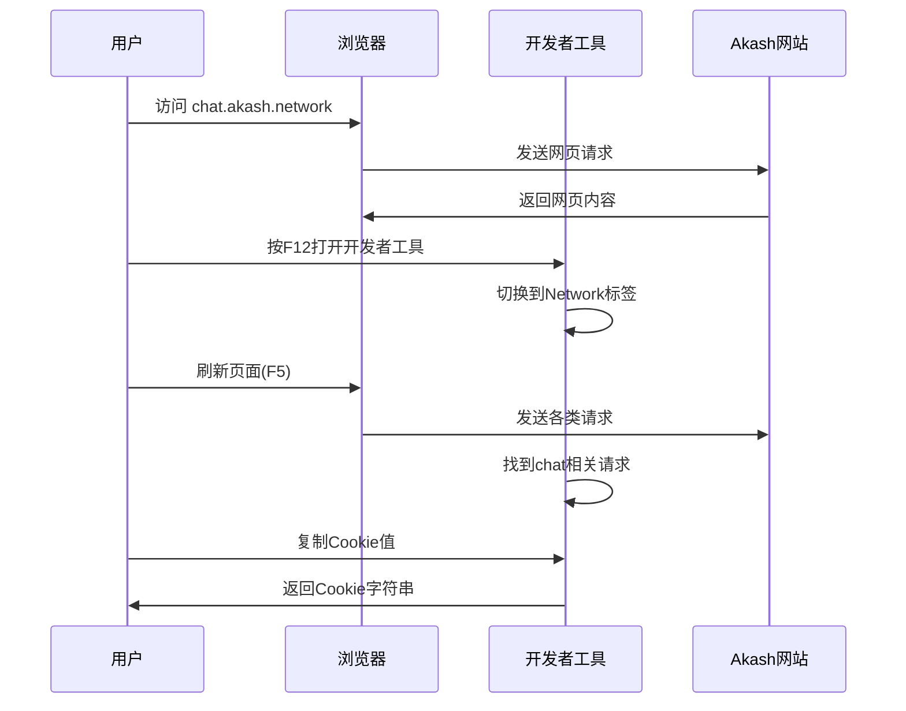
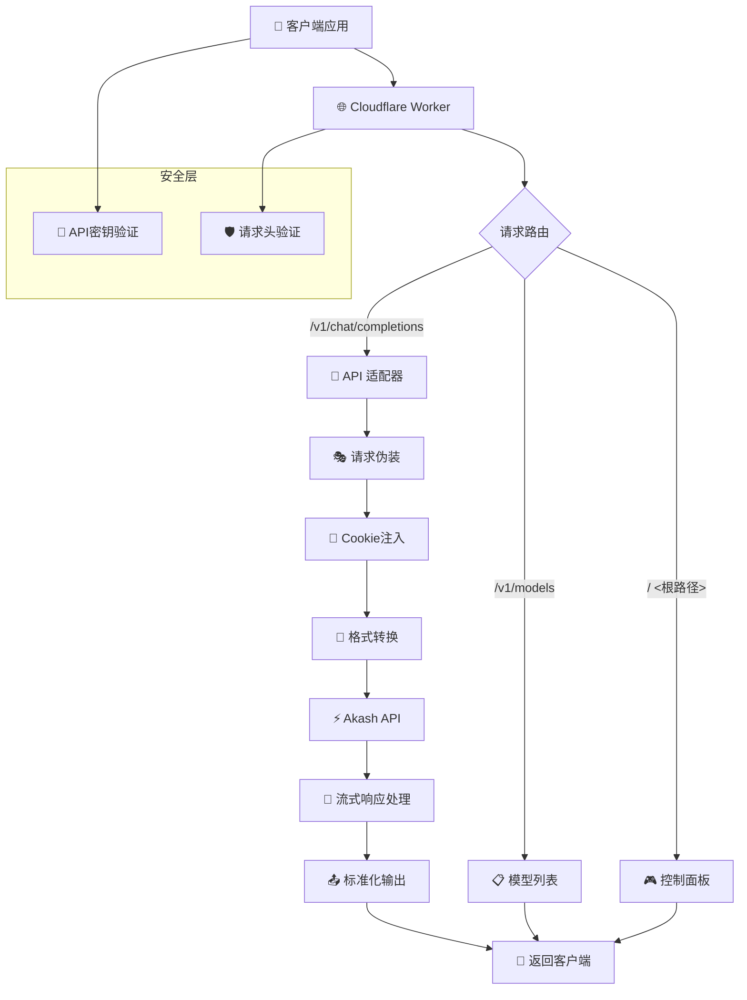

# akash-2api-cfwork (v2.0.0) - 你的私人AI算力网关 🚀

<div align="center">

[](https://github.com/lza6/akash-2api-cfwork/blob/main/LICENSE)
[](https://github.com/lza6/akash-2api-cfwork)
[](https://workers.cloudflare.com/)
[](https://sdk.vercel.ai/docs)

> **"我们并非在编写代码，我们是在为思想的自由市场构建管道。"**

</div>

## ✨ 项目概述

`akash-2api` 是一个优雅而强大的解决方案。它是一个部署在 Cloudflare Worker 上的轻量级代理，旨在将去中心化AI计算网络 Akash Network 提供的强大（且免费）的AI模型（如 DeepSeek-V3.1）无缝转换为符合 OpenAI API 标准的接口。

这意味着，你现在可以**用爱发电**，将几乎所有支持 OpenAI 的应用程序，对接到这个免费、高性能的AI模型上，而无需修改你现有的任何代码！

**v2.0.0 (代号: Session Injection - 最终修正版)** 彻底解决了 `403 Unauthorized` 验证问题，通过巧妙的会话注入和浏览器指纹伪装，实现了稳定、可靠的访问。

---

## 🎯 核心特性

<div align="center">

| 特性 | 描述 | 状态 |
|------|------|------|
| 💸 **零成本运营** | 白嫖 Akash Network 免费算力 | ✅ 已实现 |
| 🧩 **OpenAI 兼容** | 100% 兼容标准 API 格式 | ✅ 已实现 |
| 🚀 **一键部署** | Cloudflare Worker 快速部署 | ✅ 已实现 |
| 🛡️ **隐私安全** | 代码开源，数据自控 | ✅ 已实现 |
| 🎭 **完美伪装** | 绕过 Cloudflare WAF 防火墙 | ✅ 已实现 |
| 📊 **监控面板** | 内置开发者调试界面 | ✅ 已实现 |

</div>

---

## 🚀 快速开始

### 一键部署

<div align="center">

[](https://deploy.workers.cloudflare.com/deploy?url=https://github.com/lza6/akash-2api-cfwork)

</div>

### 部署流程



### 详细步骤

1. **授权登录** → 点击上方按钮，登录 Cloudflare 账户并授权
2. **项目创建** → 为项目命名（如 `my-akash-api`）
3. **环境配置** → 在 Worker 设置中添加以下变量：

| 环境变量 | 值 | 说明 |
|----------|-----|------|
| `AKASH_COOKIE` | `你的Cookie值` | [获取方法](#-获取-akash_cookie) |
| `API_MASTER_KEY` | `自定义复杂密码` | 如：`sk-my-secret-key-12345` |

4. **重新部署** → 应用环境变量变更

**恭喜！** 🎉 你的私人AI网关已就绪：
- **API 地址**: `https://my-akash-api.your-name.workers.dev/v1`
- **API 密钥**: 你设置的 `API_MASTER_KEY`

---

## 🔑 获取 AKASH_COOKIE

<div align="center">



</div>

### 详细操作步骤

1. **打开浏览器** → 推荐 Chrome/Edge
2. **访问网站** → 打开 [Akash Chat](https://chat.akash.network)
3. **开启调试** → `F12` 或右键"检查"
4. **监控网络** → 切换到 **Network** 标签页
5. **刷新页面** → 按 `F5` 捕获请求
6. **查找请求** → 找到 `chat.akash.network` 域名的请求
7. **复制Cookie** → 在 Request Headers 中复制 `cookie` 值

> **💡 温馨提示**: Cookie 会定期过期，如遇 403 错误，请重新获取并更新环境变量。

---

## 🛠️ 使用指南

### API 配置信息

| 配置项 | 值 |
|--------|-----|
| **API 端点** | `https://<你的Worker地址>/v1` |
| **API 密钥** | `你设置的 API_MASTER_KEY` |
| **模型名称** | `DeepSeek-V3.1` |

### 基础用法示例

#### 1. cURL 测试
```bash
curl -X POST "https://your-worker.workers.dev/v1/chat/completions" \
  -H "Content-Type: application/json" \
  -H "Authorization: Bearer your-api-key" \
  -d '{
    "model": "DeepSeek-V3.1",
    "messages": [
      {"role": "user", "content": "你好，请介绍一下你自己"}
    ],
    "stream": true
  }'
```

#### 2. NextChat / LobeChat 配置
- **API 地址**: `https://your-worker.workers.dev/v1`
- **API 密钥**: `your-api-key`
- **模型**: `DeepSeek-V3.1`

#### 3. JavaScript 调用
```javascript
const response = await fetch('https://your-worker.workers.dev/v1/chat/completions', {
  method: 'POST',
  headers: {
    'Content-Type': 'application/json',
    'Authorization': 'Bearer your-api-key'
  },
  body: JSON.stringify({
    model: 'DeepSeek-V3.1',
    messages: [{role: 'user', content: 'Hello!'}],
    stream: true
  })
});
```

---

## 🏗️ 系统架构

<div align="center">



</div>

### 核心组件详解

| 组件 | 功能 | 技术实现 |
|------|------|----------|
| **🌐 入口网关** | 接收所有客户端请求 | `fetch(event.request)` |
| **🔄 API 适配器** | OpenAI → Akash 格式转换 | 消息重组、协议适配 |
| **🎭 请求伪装** | 绕过 WAF 防护 | Header 注入、Cookie 管理 |
| **🔄 流式处理** | 实时数据流转换 | `TransformStream` 管道 |
| **🔐 安全层** | 访问控制和验证 | API Key 校验、请求过滤 |

### 技术实现原理

```javascript
// 核心处理流程伪代码
async function handleChatCompletions(request) {
  // 1. 认证验证
  if (!await authenticate(request)) {
    return new Response('Unauthorized', { status: 401 });
  }
  
  // 2. 请求解析与重构
  const openAIRequest = await parseOpenAIRequest(request);
  const akashPayload = transformToAkashFormat(openAIRequest);
  
  // 3. 身份伪装
  const headers = createSpoofedHeaders();
  headers.set('Cookie', env.AKASH_COOKIE);
  
  // 4. 代理请求
  const akashResponse = await fetch(UPSTREAM_API, {
    method: 'POST',
    headers: headers,
    body: JSON.stringify(akashPayload)
  });
  
  // 5. 流式响应处理
  if (openAIRequest.stream) {
    return createStreamingResponse(akashResponse);
  }
  
  return createStandardResponse(akashResponse);
}
```

---

## 📊 开发者控制台

访问你的 Worker 根路径即可使用内置控制台：

<div align="center">


</div>

**功能特性：**
- ✅ API 状态监控
- ✅ 实时请求测试
- ✅ 流式响应预览
- ✅ 配置信息展示
- ✅ 错误诊断工具

---

## 🗺️ 项目路线图

### ✅ 已实现功能

- [x] **核心代理网关** - OpenAI 到 Akash 的完整协议转换
- [x] **会话保持机制** - Cookie 注入解决 403 验证问题
- [x] **流式响应支持** - 兼容 Vercel AI SDK 的流式传输
- [x] **标准化接口** - `/v1/chat/completions` & `/v1/models`
- [x] **安全认证** - API Key 访问控制
- [x] **开发者工具** - 内置测试和调试界面

### 🚧 开发中功能

- [ ] **多 Cookie 轮询** - 自动切换失效凭证
- [ ] **请求缓存层** - 提升响应速度，减少上游压力
- [ ] **监控仪表板** - 请求统计和性能监控
- [ ] **自动 Cookie 刷新** - 定时更新认证凭证

### 🔮 未来规划

- [ ] **多模型支持** - 扩展支持其他 Akash 模型
- [ ] **负载均衡** - 多个 Akash 节点智能路由
- [ ] **高级功能** - Function Calling、Vision 等
- [ ] **集群部署** - 高可用架构支持

---

## 🐛 故障排除

### 常见问题解决方案

| 问题 | 症状 | 解决方案 |
|------|------|----------|
| **403 错误** | `Unauthorized` 响应 | 1. 检查 AKASH_COOKIE 是否过期<br>2. 重新获取最新 Cookie<br>3. 更新环境变量 |
| **流式中断** | 响应不完整或超时 | 1. 检查网络稳定性<br>2. 验证 stream 参数设置<br>3. 查看 Worker 日志 |
| **模型不可用** | `Model not found` | 1. 确认模型名称 `DeepSeek-V3.1`<br>2. 检查 Akash 服务状态 |
| **速率限制** | 请求被拒绝 | 1. 降低请求频率<br>2. 实现请求队列<br>3. 使用缓存机制 |

### 日志诊断

启用 Worker 日志查看详细错误信息：

```bash
# 在 Worker 仪表板中查看日志
# 或使用 wrangler CLI
wrangler tail
```

---

## 🤝 参与贡献

我们欢迎各种形式的贡献！以下是参与方式：

### 代码贡献
1. Fork 本仓库
2. 创建功能分支 (`git checkout -b feature/AmazingFeature`)
3. 提交更改 (`git commit -m 'Add some AmazingFeature'`)
4. 推送到分支 (`git push origin feature/AmazingFeature`)
5. 开启 Pull Request

### 问题反馈
- [报告 Bug](https://github.com/lza6/akash-2api-cfwork/issues)
- [请求功能](https://github.com/lza6/akash-2api-cfwork/issues)

### 开发环境搭建

```bash
# 克隆项目
git clone https://github.com/lza6/akash-2api-cfwork.git
cd akash-2api-cfwork

# 安装依赖
npm install

# 本地测试
wrangler dev

# 部署
wrangler deploy
```

---

## 📜 开源协议

本项目采用 **Apache License 2.0** 协议发布。

**简单来说：**
- ✅ **允许**：商业使用、修改、分发、专利授权
- ✅ **要求**：保留版权声明、包含许可文本
- ✅ **提供**：明确的专利授权
- ❌ **不承担**：作者法律责任、商标授权

详见 [LICENSE](LICENSE) 文件。

---

## 🌟 支持与鼓励

如果这个项目对你有所帮助，请考虑：

1. **⭐ Star 这个仓库** - 让更多人看到
2. **🐛 报告问题** - 帮助改进项目
3. **💡 分享创意** - 提出新功能建议
4. **🔧 贡献代码** - 共同建设生态

---

## 🎉 结语

这个项目证明了：**智慧可以绕过壁垒，开源能够连接世界**。

> **"在技术的世界里，限制只是等待被绕过的挑战，而非不可逾越的障碍。"**

现在，去创造一些令人惊叹的东西吧！✨

---

<div align="center">

**由 ❤️ 构建 | 为社区服务 | 向未来致敬**

[文档](https://github.com/lza6/akash-2api-cfwork) | [问题反馈](https://github.com/lza6/akash-2api-cfwork/issues) | [讨论区](https://github.com/lza6/akash-2api-cfwork/discussions)

</div>

---

*注：本项目仅供学习和研究使用，请遵守相关服务的使用条款。*
